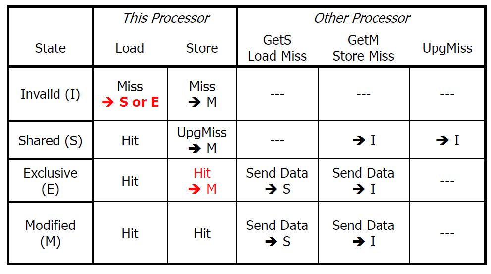

# MESI Protocol

### Motivation:

- many UpgMiss events on the bus even when only one cache has the data in Modified state
- allow for silent upgrades in these situations

### States in the MESI Protocol:
- Modified (M): 
    - The cache line is present only in this cache and has been modified. It is not up-to-date in the main memory. The cache must write this data back to the main memory when it is evicted or when another cache needs to read it.

- Exclusive (E): 
    - The cache line is present only in this cache but has not been modified. It is up-to-date in the main memory. This state indicates that no other cache has a copy of this cache line. If the processor wants to write to this line, it can change the state to Modified without notifying other processors, since no other processor has the data.

- Shared (S): 
    - The cache line may be stored in this cache as well as in other caches and is not modified. All copies in caches are consistent with the main memory. This state is used when multiple caches want to read from the same memory location.

- Invalid (I): 
    - The cache line is not present in this cache. To use the data, the cache must fetch it from the main memory or from another cache that holds the data in the Modified or Exclusive state.

### Important Ideas:
- Maintain a sharers list 
- Upon a local cache load miss, get data and move to E if no sharers. Else move to S if there are sharers

- I am in E state - load hit - stay in E state

- Local cache store hit - move to M state and generate UpgMiss only if local cache was in S state

- I am in E state - do a local store - move to M state because main memory is different now - means, if the cache line is in the Exclusive state, it can be written directly and transition to Modified without bus transactions, as no other cache has the line. 

- Write Miss: If a processor writes to an Invalid cache line, it must acquire the line in Exclusive or Modified state depending on whether the data is cached elsewhere or not. Other caches holding the line in Shared state must invalidate their copies

- when shared cache sends data, marks it as dirty for when private caches do silent upgrades and don't generate UpgMiss on the bus.

### State transtions:

### Benefits:
- Efficiency: 
    - MESI reduces bus traffic by allowing a processor to write to a cache line in the Exclusive state without sending invalidation messages on the bus.

- Performance: 
    - It decreases the latency for write operations that hit in the Exclusive state, as no other caches need to be invalidated.