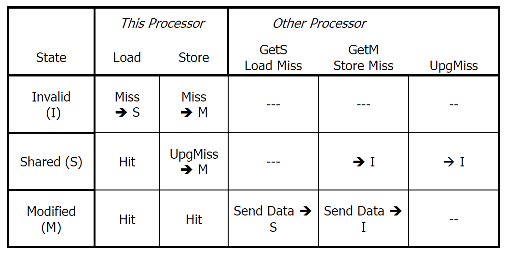

# MI Protocol

Type of Invalidate protocol -> When a core does a store in its private cache, it generates an event on the bus for other cores to invalidate their own copies, if they have them.

Two states: Valid/Modified and Invalid

Valid state - has cache block
Invalid state - does not have a cache block

### Operational Mechanics:

Load :
    - If core is in Invalid state, generate GetS on the bus and get address from main memory or other private caches
    - If core is in Valid state, stay in the same state

Write :
    - If in invalid state, generate GetM on the bus. Someone will respond with the address.
    - If it is in Valid state, invalidate all other caches, generate PutM on the bus and modify local data and move to Valid state

Points to remember:
- Only one cache in valid state at a time - one owner of the data
- Memory sends data when no processor responds
- Only cache controller associated with each Cache does snooping of the bus
- Problem: Does not let multiple caches have the same data even if it is read-only. 

### Cache operations with States:

- Load/Store: 
If a processor executes a load (read) or store (write) operation and the cache line is already in the Valid state, it can proceed without changing the state.
- GetS, GetM, PutM: These are coherence messages that might be sent between caches. GetS (Get Shared) is a request for a shared copy of the data, GetM (Get Modified) is a request to get the data and modify it, and PutM (Put Modified) indicates that the cache is writing back the modified data to the main memory.
- Load, Store (on the V state), indicates that if the cache line is valid, it can perform read and write operations directly.
- GetS, GetM, PutM (on the I state), indicates that on a read or write miss, the cache must communicate with the memory system to fetch the data (GetS, GetM) or to update the main memory with the modified data (PutM) and then possibly change the state to Valid.

### State transition table:

