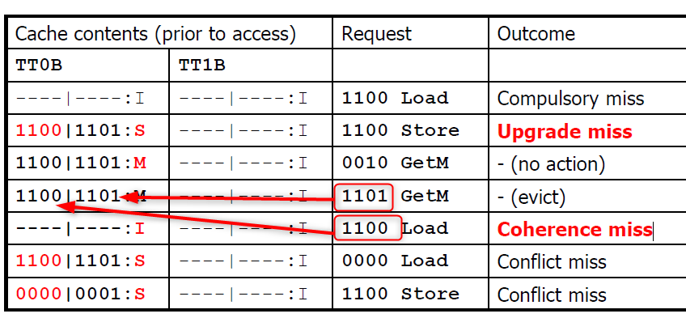

# MSI Protocol

### States:
- Invalid:
    - private cache does not have the data because it either never used it before, or other cache has modified it locally and invalidated it 
    - has to fetch it from memory/other caches

- Shared:
    - more than one caches have this data 
    - data in this block is clean (same as memory)
    - caches can continue reading this data without operations on the bus

- Modified:
    - only one cache can have a block in the modified state at a time 
    - this cache is the exclusive owner of that block
    - others will either not have it, or have it in invalid state - they have to get it from this cache when they want to access it 

### Cache Operations and State Changes:

- Local cache in Invalid state - tries a load - misses - generates a load miss (GetS) on bus - memory/other cache responds - goes to S (shared) state

- CPU is in invalid state - tries a store - misses - write miss placed on the bus - goes to Modified state after fetching the block - no other caches have this latest data yet

- CPU in shared state - load hit - stay in shared state - no communication needed on bus because it has the latest copy - no other core has done a store

- CPU is in shared state - does a store and this is a write hit - invalidates other copies by placing invalidate on the Bus with UpgMiss event

- CPU in modified state - does a load - hit - only this cache has the latest data so uses it - no action required on bus (no other core wants this data yet)

- if CPU is in modified state and does a store again - generate UpgMiss - when you see another core generating a GetS or GetM and this cache has the latest data - send the data and move to I state for store miss and S state for a load miss

### Problems with this protocol:

- Too many unnecessary UpgMiss events on bus when it could have been done silently
- Introduces two new kinds of misses: Upgrade miss and Coherence Miss
- Coherence Miss: Local cache has a block in Modified state - sees a GetM on bus (write miss from another core) - gives up its own complete cache line and goes to I state - next time it does a load for the same cache line but not the exact address that the other core was looking for, it becomes a cache miss

Cache Coherence Miss example:

### State Transition Table:

